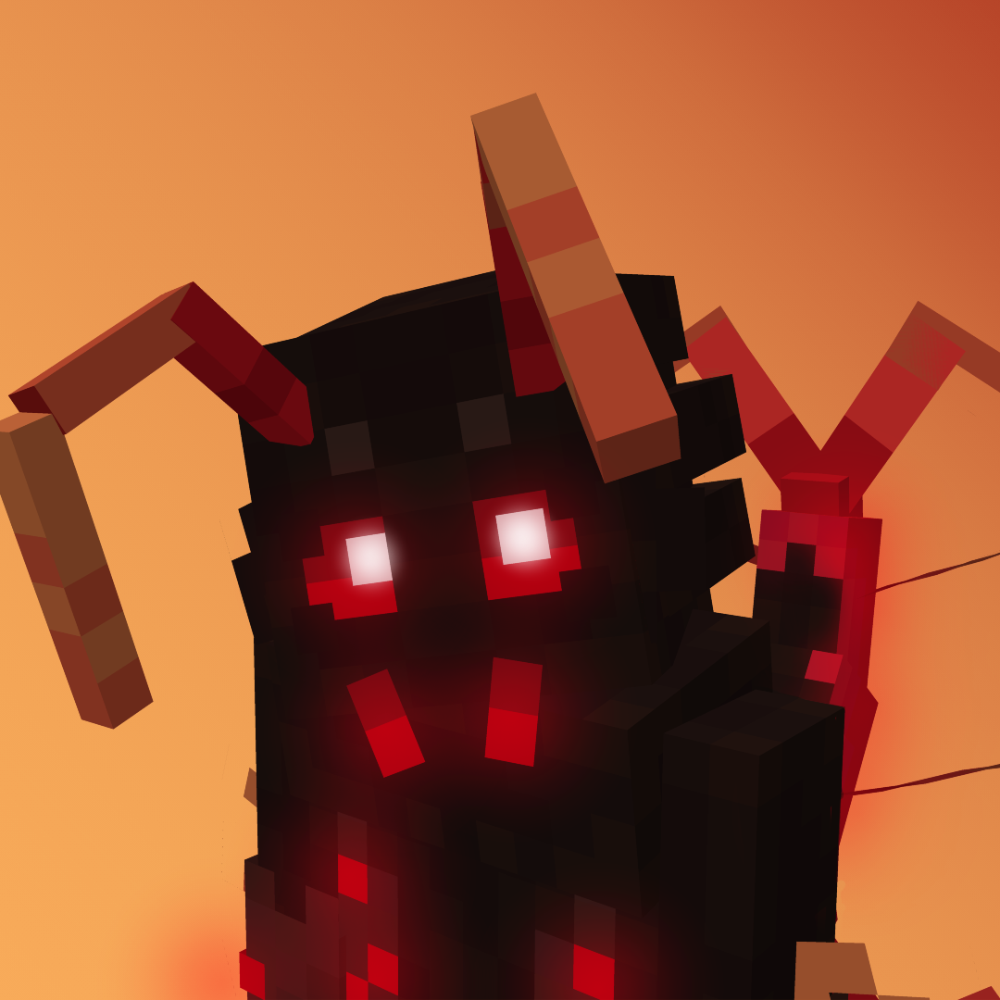

<h1>Meet the Crawlipede!</h1>

 
The cutest critter....

<h2>Features</h2>

<ul>
  <li> Tail leg animations
  <li> Tail swinging physics
  <li> Antennae physics
  <li> Eye physics
  <li> Head smoothing
  <li> Slight tooth chitter animation
  <li> Emissive textures
  <li> (Optional) Extremely joyful walk bounce
</ul>

<h2>How to enable joyful walk</h2>

This is purely option if you just want to have some fun with the model, go into the script.lua and scroll all the way down, then, modify the bouncemodifier to anything above ~0.6

<h2>API Used</h2>

- SquishyAPI
- SwingAPI

